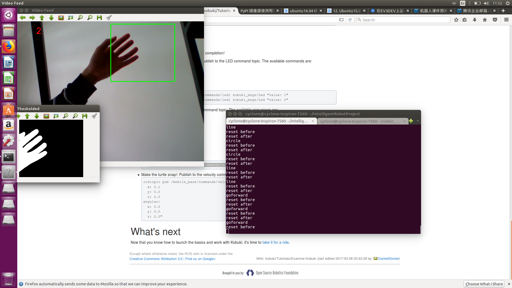

Intelligent Robot Final Project
===
#### 2018.1.4

---
## Main Idea

Control our robot with gesture recognition.
 - Open CV
 - ROS Topic
 - Multithread/Multiprocess
 - Combine Opencv, ROS(CPP), Linux Bash Shell together with Python.

---
## Open CV Core Code
```python
def reset():
    global status
    print 'reset before'
    time.sleep(5.5)
    print 'reset after'
    status = 0
```
```
if status == 0:
    if fingers == 2:
        p = subprocess.Popen('rosrun turtle_move line', stdout=subprocess.PIPE, shell=True)
        print 'line'
        thread.start_new_thread(reset, ())
    elif fingers == 1:
        p = subprocess.Popen('rosrun turtle_move circle', stdout=subprocess.PIPE, shell=True)
        print 'circle'
        thread.start_new_thread(reset, ())
    else:
        p = subprocess.Popen('rosrun turtle_move move_turtle_goforward', stdout=subprocess.PIPE, shell=True)
        print 'goforward'
        thread.start_new_thread(reset_forward, ())
```
---
## ROS Package
```CPP
while (ros::ok())
  {
    time_t current = time(NULL);
    if (current - start > 5.0f)
      break;
    speed.linear.x = 0.1; // 设置线速度为0.1m/s，正为前进，负为后退
    speed.angular.z = vel_rad; // 设置角速度为0rad/s，正为左转，负为右转
    cmdVelPub.publish(speed); // 将刚才设置的指令发送给机器人
    loopRate.sleep();//休眠直到一个频率周期的时间
  }
```
---
## Gesture Recognition


---
## Usage:
```
export ROS_MASTER_URI=http://hostip:11311
export ROS_IP=`hostname -I`
catkin_make
source devel/setup.bash
python recongnize.py
```

---
## Our Source Code:
 - <https://github.com/DiveIntoMachineLearningSUSTech/IntelligentRobotProject>
 - <https://github.com/DiveIntoMachineLearningSUSTech/turtle_move>